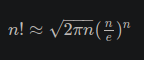

Fakulteta n
je produkt prvih n
naravnih števil:

n!=1⋅2⋅3⋅…⋅(n−1)⋅n


Za velika števila n
si pri izračunu fakultete pogosto pomagamo s Stirlingovim približkom (ali Stirlingovo formulo):




1) Napišite metodi

   ``static long fakultetaL(int n);``

   ``static long stirlingL(int n);```


ki izračunata in vrneta fakulteto števila n, prva po definiciji, druga po Stirlingovi formuli.

Opomba: Ker je je izračunana vrednost Stirlingove formule realna, mora metoda stirlingL() vrniti vrednost, zaokroženo na celo število. Za to lahko uporabimo metodo Math.round().


2) Napišite tudi metodo main(), v kateri izračunate in izpišete vrednosti obeh metod iz točke 1) za prvih 20 vrednosti števila n
   . Poleg tega izračunajte in izpišite tudi relativno napako Stirlingove formule. Izpis naj bo natanko tak:

``
 n              n!            Stirling(n)      napaka (%)
----------------------------------------------------------
  1                    1                    1   0.0000000
  2                    2                    2   0.0000000
  3                    6                    6   0.0000000
  4                   24                   24   0.0000000
  5                  120                  118   1.6666667
  6                  720                  710   1.3888889
  7                 5040                 4980   1.1904762
  8                40320                39902   1.0367063
  9               362880               359537   0.9212412
 10              3628800              3598696   0.8295855
 11             39916800             39615625   0.7545069
 12            479001600            475687486   0.6918795
 13           6227020800           6187239475   0.6388500
 14          87178291200          86661001741   0.5933696
 15        1307674368000        1300430722199   0.5539335
 16       20922789888000       20814114415223   0.5194120
 17      355687428096000      353948328666101   0.4889404
 18     6402373705728000     6372804626194313   0.4618456
 19   121645100408832000   121112786592294192   0.4375958
 20  2432902008176640000  2422786846761135104   0.4157653 
 ```


3) Ker vrednost fakultete z večanjem števila n
 zelo hitro narašča, bo podatkovni tip long kmalu premajhen. Ugotovite, do katere vrednosti n
 je ta tip še primeren za izračun vrednosti fakultete.


